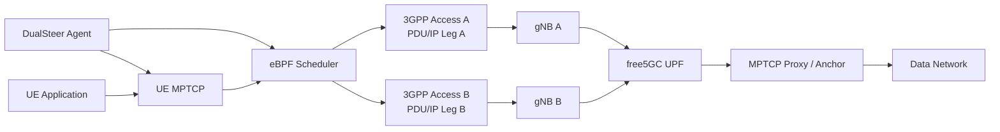
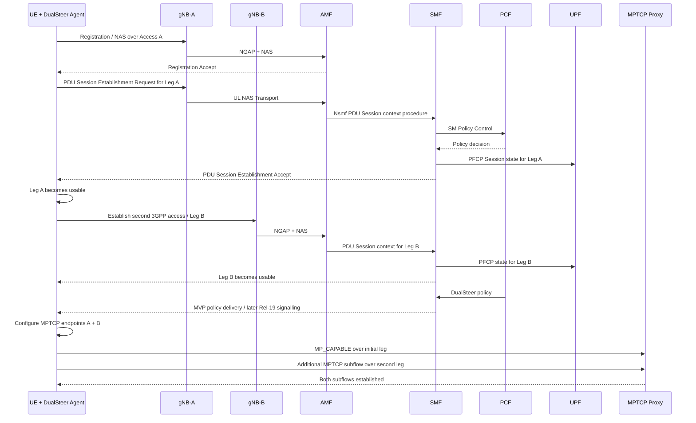
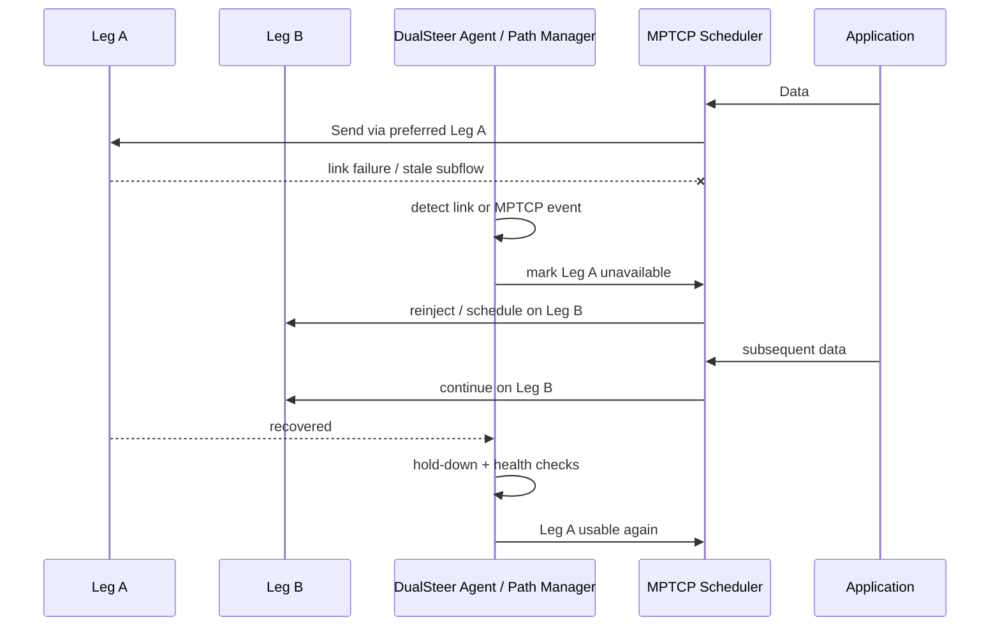

# 以 ATSSS Reuse 為基礎在 free5GC 上實作 3GPP DualSteer 的可行性與實作計畫

## 執行摘要

**結論：可行，而且我不建議先把整套 ATSSS 完整復現後才開始 DualSteer。** 更好的路線是：先把 `carlhus/atsss` 中最有價值、同時也是風險最高的 **ATSSS data-plane vertical slice** 復現出來，也就是「兩條 IP path → MPTCP subflows → eBPF scheduler → MPTCP Proxy → iperf3」，確認 `bpf_rr_quota`、`bpf_rtt`、MPTCP Proxy、修改版 kernel 都能工作；完成這一小段後，就直接切到 **DualSteer-first architecture**，不要再投入大量時間復現 N3IWF、IKE/IPsec/GRE 與完整 MA PDU Session。這是因為 DualSteer 的 3GPP 定義核心是 **upper-layer traffic steering/switching over dual 3GPP access**，而 ATSSS 原始架構是 3GPP + non-3GPP multi-access；兩者最值得共用的是上層 multipath/data-plane steering 技術，而不是 N3IWF 本身。3GPP 將 DualSteer 列為 Rel-19 Work Item，正式名稱即為「Upper layer traffic steering and switching over dual 3GPP access」；其前導研究為 TR 22.841，以及後續 SA2 的 TR 23.700-54「Study on Multi-Access (DualSteer and ATSSS_Ph4)」。citeturn18search0turn18search7turn18search1

你提供的論文其實已經替這條路線做了很好的 data-plane proof-of-concept：論文第 3 章把 ATSSS 的上、下行都抽象成「MPTCP Sending Queue → eBPF Packet Scheduler → 某一個 access subflow」，Load Balancing 使用 Weighted Round Robin，Smallest Delay 使用 TCP `srtt_us`；第 4 章則驗證權重分流與 delay switching 都能運作。換句話說，**最能 reuse 到 DualSteer 的核心不是 N3IWF，而是 MPTCP + scheduler + link-specific IP + policy-to-kernel mechanism**。fileciteturn0file0

`carlhus/atsss` 的 repo 也印證這點。Repo 本身分成 `ATSSS-UE`、`ATSSS-UPF`、`ATSSS-N3IWF`、`UERANSIM`、`free5gc` 五大區塊；UPF 端另外包含 `gtp5g-ATSSS`、`mptcp-proxy`、修改版 `mptcp_net-next` 與 RFC 8803 converter module。fileciteturn2file0L1-L10 fileciteturn21file0L1-L10

但這個 repo **不是一套「開箱即用、policy 全自動貫穿」的 ATSSS implementation**。它比較像研究 prototype 的程式碼集合：SMF 具備 ATSSS NAS Container 產生與 PFCP steering 資料模型；PCF 卻主要固定產生 Active-Standby policy；UE 的 dispatcher 對 Load Balancing / Smallest Delay 主要只有 mode dispatch/log，而論文真正驗證這兩個模式時，是透過修改 kernel、eBPF scheduler、sysctl 與腳本完成。fileciteturn14file0 fileciteturn18file0 fileciteturn9file0

因此，我的建議架構是：

> **保留 ATSSS 的 data-plane 技術，丟掉 non-3GPP access assumption，重新建立 DualSteer control abstraction。**

也就是把原本：

`3GPP + N3IWF/non-3GPP → MPTCP`

改為：

`3GPP Access A + 3GPP Access B → MPTCP`

並把程式裡的：

`3GPP / NON_3GPP`

改成：

`LEG_A / LEG_B`

或：

`PRIMARY_3GPP / SECONDARY_3GPP`

而不是試圖把第二條 3GPP access 偽裝成 `NON_3GPP`。

**同一台 VM 實作也可行。** 論文用五台 VM 是為了讓兩條通道在硬體與網路環境上更獨立、較接近真實 deployment，而不是因為 Linux 技術上必須分五台 VM。Linux MPTCP 的 scheduler、path manager 與相關 sysctl 是 network-namespace scoped，因此 UE、UPF、不同 RAN path 可以用 namespace / container 隔離；Docker Compose 也能建立多組 bridge network。fileciteturn0file0 citeturn20search0turn20search1turn20search2

但有一個非常重要的限制：**Docker / network namespace 共用同一個 host kernel。** 所以如果 UE 與 UPF 都使用論文相同的 patched MPTCP kernel，單 VM 很適合；如果兩邊最後需要不同 kernel patch，Docker 就不夠，必須用 KVM/QEMU nested VM 或真正的多 VM。Docker 官方亦明確區分 container 共用 host kernel，而 microVM 才具有自己的 kernel。citeturn20search10

我建議最終開發路線如下：

```text
carlhus/atsss
      │
      ├── 只復現 MPTCP/eBPF/Proxy data-plane
      │
      ▼
DualSteer Data-plane MVP
3GPP-A + 3GPP-B → MPTCP → eBPF → Proxy
      │
      ▼
DualSteer Agent / Policy abstraction
      │
      ▼
free5GC PCF / SMF integration
      │
      ▼
Rel-19 normative signalling alignment
```

這條路比「先完整重現 ATSSS → 再拆掉 N3IWF → 再改 DualSteer」更合理。

## carlhus/atsss 與論文的實作對照

### Repo 模組如何對應論文

論文第 3 章的架構可以直接映射到 repo。論文中的 UE 端包含 3GPP UE、non-3GPP UE、MPTCP 與 eBPF scheduler；UPF 端則有 GTP5G、MPTCP Proxy 與同樣的 MPTCP scheduler。fileciteturn0file0 Repo 根目錄亦確實把這些功能拆成 UE、UPF、N3IWF、UERANSIM 與 free5GC。fileciteturn2file0L1-L10

| 論文概念 | carlhus/atsss 主要位置 | 實際角色 | DualSteer reuse 價值 |
|---|---|---|---|
| 3GPP UE / gNB | `UERANSIM/` | 建立 3GPP access / PDU connectivity | **高** |
| non-3GPP UE | `ATSSS-UE/n3ue/` | N3IWF registration、PDU Session、ATSSS IE handling | 中，主要 reuse policy/parser 架構 |
| UE MPTCP kernel | `ATSSS-UE/mptcp_net-next/` | MPTCP scheduler hooks、custom fields/sysctl | **非常高** |
| UE eBPF LB | `.../mptcp_bpf_rr_quota.c` | Weighted Load Balancing | **非常高** |
| UE eBPF RTT | `.../mptcp_bpf_rtt.c` | Smallest Delay | **非常高** |
| ATSSS UE steering | `ATSSS-UE/n3ue/internal/atsss/` | ATSSS Rule → route/MPTCP endpoint | 高，但需重構 |
| N3IWF | `ATSSS-N3IWF/free5gc/` | non-3GPP access | **DualSteer 不應依賴** |
| free5GC PCF | `free5gc/NFs/pcf/...` | 產生 TrafficControlData / steering policy | **高**，適合作 policy skeleton |
| free5GC SMF | `free5gc/NFs/smf/...` | ATSSS NAS Container + PFCP MAR | **高**，適合作 control-plane skeleton |
| UPF | `ATSSS-UPF/free5gc/` | User-plane termination | 高 |
| `gtp5g-ATSSS` | `ATSSS-UPF/gtp5g-ATSSS/` | multi-access user-plane support | 高但需要改成 dual-3GPP semantic |
| MPTCP Proxy | `ATSSS-UPF/mptcp-proxy/` | MPTCP convergence / converter endpoint | **非常高** |
| RFC 8803 converter | `RFC-8803-kernel-module/`、UE converter | legacy TCP → MPTCP conversion | 選用 |

UPF tree 確實同時包含 `RFC-8803-kernel-module`、`gtp5g-ATSSS`、`mptcp-proxy` 與一份 `mptcp_net-next`，所以這份 repo 的 data plane 並不是單純修改 free5GC UPF，而是一整套 kernel + GTP + MPTCP convergence prototype。fileciteturn21file0L1-L10

### MPTCP scheduler 是最值得保留的部分

`mptcp_bpf_rtt.c` 直接遍歷 MPTCP subflows，取得每個 TCP subflow 的 `srtt_us`，選出最小值後透過 `mptcp_subflow_set_scheduled()` 指定該 subflow。這與論文第 3.2.2 節所描述的 Smallest Delay 完全對應。fileciteturn11file0 fileciteturn0file0

Load Balancing 則由 `mptcp_bpf_rr_quota.c` 實作。它從 `mptcp_sock` 讀取 `weight_3gpp`，再為兩條 subflow 維護 weight / quota，與論文描述的 Weighted Round Robin 思路一致。Repo 甚至對 `mptcp_sock` 新增了 `weight_3gpp` 等欄位。fileciteturn13file0 fileciteturn12file4L65-L76

Linux 本身現在也把 Path Manager 視為管理 MPTCP subflow 建立、刪除與 address advertisement 的標準元件，並支援 userspace Path Manager，允許 userspace daemon 對不同 MPTCP connection 套不同規則。這非常適合把論文中透過 sysctl 與 hard-coded address 管理 policy 的方式升級成 `dualsteer-agent + Netlink + BPF map`。citeturn20search1turn20search0

### free5GC control plane 已有相當多可以 reuse 的骨架

`SMContext` 已加入 `AtsssCapab`、`AtsssRules`、`AtsssRuleIDGenerator` 與 `AtsssControlParameterInfo` 等狀態。UE context 同樣保存 ATSSS Rules、Network Steering Function Information、Measurement Assistance Information 與 MPTCP endpoints。fileciteturn8file2L33-L47 fileciteturn8file4L63-L75

更重要的是，`gsm_build.go` 已經會依 `TrafficControlData` 將：

- `ACTIVE_STANDBY`
- `LOAD_BALANCING`
- `PRIORITY_BASED`
- `SMALLEST_DELAY`

轉成 NAS ATSSS Access Selection Descriptor；Load Balancing 的 `Var3gLoad` 也能進 NAS ATSSS Rule。fileciteturn14file0 fileciteturn19file1L14-L24

SMF data-path code 同時會把 Load Balancing weight 寫入 PFCP multi-access forwarding state，例如 3GPP weight 使用 `Var3gLoad`、另一 access 使用 `100 - Var3gLoad`。fileciteturn19file0L1-L13

所以這套 code 的 **policy data model → SMF rule → NAS/PFCP encoding** 是值得 reuse 的。

### 但 repo 與論文真正完成的功能之間有幾個重要落差

第一個落差是 **PCF policy selection 沒有真的把四種 mode 自動化**。目前檢查到的 `pcf/internal/sbi/producer/smpolicy.go`，對 MA PDU request 建立的 UL / DL `SteeringMode` 預設仍是 `ACTIVE_STANDBY`，再依 current/additional access 填 active / standby；雖然 SMF 支援其他 mode 的 encoding，但 PCF 並沒有在這段程式中根據 RTT、operator policy 或 profile 自動選成 Load Balancing / Smallest Delay。fileciteturn18file0

第二個落差是 **UE steering dispatcher 與 kernel scheduler 沒有完整接起來**。`SteeringFunDispatcher()` 會解析第一條 ATSSS Rule 的 steering mode；Active-Standby 有處理分支，但部分情況會直接印 `Unimplement`，而 `SmallestDelay` / `LoadBalancing` case 在所檢查的檔案中主要只記錄 mode，實際的 `SmallestDelayFun()` 呼叫甚至被註解掉。fileciteturn9file0

第三個落差是 **scheduler 有大量 prototype hard-code**。例如 `mptcp_bpf_rr_quota.c` 直接寫：

```c
char *addr3GPP    = "172.16.0.2";
char *addrNon3GPP = "172.16.0.3";
```

並且有 `bool isDL = true` 這種 compile-time direction assumption。fileciteturn13file0

README 的實驗交接方式也顯示，UE / UPF 需要手動調整 direction、scheduler 與 `Load_balancing_weight`，而不是由 PCF → SMF → UE policy 自動完成。fileciteturn0file1 Repo 的測試 script 也直接寫入 `net.mptcp.Load_balancing_weight` 以及兩個 link-specific address。fileciteturn5file9L115-L125

第四個落差是 **Smallest Delay 有兩套概念互相重疊**。真正漂亮的方式是 kernel/eBPF `bpf_rtt` 直接讀 `srtt_us`；但 UE `mptcpSteering.go` 中又有 userspace prototype，以固定週期呼叫 command、取得 TCP info、刪除/重建 MPTCP endpoint，且包含 `172.16.0.2`、`172.16.0.3`、`uesimtun1`、`gretun-id-2` 等 hard-coded 值。fileciteturn9file0

第五個落差是 **MPTCP Proxy 也是固定 lab configuration**。其設定預設為：

```yaml
bindAddress: 172.16.0.1
bindPort: 1234
```

並直接依賴 RFC 8803 kernel module 的 parameter path。fileciteturn24file0

因此這份 repo 最適合被視為：

> **ATSSS research prototype + 可 reuse 的 kernel/data-plane implementation**

而不是：

> 完整的 production-ready ATSSS reference stack。

這個判斷非常重要，因為它直接回答「是否需要完整重現 ATSSS」：**不需要。**

## 可行性判斷與路線選擇

### 不需要先完整復現 ATSSS

3GPP DualSteer 與 ATSSS 有高度概念相似性，但不是同一個 access model。ATSSS Rel-16 的典型 MA PDU Session 是 3GPP + non-3GPP access；DualSteer 的 Work Item 定義則明確強調 **dual 3GPP access**。DualSteer 的早期 study 甚至以「upper layer traffic steering, switching and split over dual 3GPP access」為題。citeturn18search0turn18search7turn18search13

所以如果你完整復現：

```text
3GPP
  \
   MA PDU → ATSSS → MPTCP
  /
N3IWF / non-3GPP
```

然後才開始 DualSteer，你最終一定要把：

```text
N3IWF
IKE
IPsec
GRE
non-3GPP registration
non-3GPP NAS transport
```

大部分拿掉或旁路，改成第二套 3GPP access。

這會產生大量「為了重現而重現」的工作。

我建議的最低 baseline 是：

```text
ATSSS minimum reproduction
──────────────────────────
patched MPTCP kernel      ✓
bpf_rr_quota              ✓
bpf_rtt                   ✓
two MPTCP subflows        ✓
MPTCP Proxy               ✓
iperf3                    ✓

MA PDU signalling          不必先完成
N3IWF                      不必先完成
IKE/IPsec                  不必先完成
full PCF ATSSS policy      不必先完成
PMF                        不必先完成
```

這樣你仍然能證明：

> 「我的 DualSteer data plane 是從論文 ATSSS implementation reuse 而來，而不是完全重寫。」

同時不會被 N3IWF 的問題綁住。論文本身也指出 non-3GPP uplink 的 GRE path 在實驗中有較不穩定的 delay，而 DualSteer 的 dual-3GPP 架構本來就沒有必要帶這個 artifact 進來。fileciteturn0file0

### 兩條路線比較

以下工期是以「一名熟悉 Linux networking / Go / free5GC 的工程或研究人員」估算，屬於工程規劃，不是 3GPP 規範數字。

|  | 方案 A：完整 ATSSS 復現後再改 | 方案 B：從 repo 直接做 DualSteer |
|---|---|---|
| 起點 | 重建論文五 VM / MA PDU / N3IWF | 先重建 MPTCP/eBPF vertical slice |
| 第一階段 | ATSSS UE + N3IWF + gNB + CP + UPF | dual 3GPP paths + MPTCP |
| 第二階段 | 驗證 Active/Standby、LB、RTT | 建 `DualSteerPolicy` + agent |
| 第三階段 | 把 non-3GPP 換成第二 3GPP | PCF/SMF integration |
| N3IWF | 必須投入 | **不需要** |
| custom kernel | 必須 | 必須或逐步減少 |
| MPTCP Proxy | reuse | reuse |
| eBPF scheduler | reuse | **直接 reuse** |
| free5GC PCF/SMF | 先維持 ATSSS，再重構 | 直接加入 DualSteer abstraction |
| 第一個可用 data-plane demo | 約 3–5 週 | **約 1–2 週** |
| 具 policy 的 MVP | 約 7–12 週 | **約 5–9 週** |
| Rel-19 protocol alignment | 另加高風險工作 | 另加高風險工作 |
| 最大風險 | 花很多時間 debug 不會保留的 N3IWF | 一開始與論文 topology 不完全相同 |
| 論文 reproducibility | **最高** | 中高 |
| DualSteer reusable code | 中 | **最高** |
| 我的建議 | 若研究題目是「比較 ATSSS 與 DualSteer」才選 | **你的情況優先選** |

### 最推薦的是「B+」而非純 B

我不建議完全跳過 ATSSS source validation。最穩健的做法是：

**先花約數天到一週做 ATSSS data-plane smoke test，之後立即 fork DualSteer。**

成功標準只有：

```text
UE-side kernel boot        PASS
UPF-side kernel boot       PASS
MPTCP enabled              PASS
2 subflows established     PASS
bpf_rr_quota loaded        PASS
80/20 ≈ 80/20 traffic      PASS
bpf_rtt loaded             PASS
tc delay changes path      PASS
MPTCP proxy working        PASS
```

到這裡就停止 ATSSS reproduction。

這可以把最危險的未知數——custom kernel、BPF helpers、MPTCP scheduler ABI、proxy/converter——先排除。

### free5GC 要選哪一版

截至目前官方 release 頁面列出的 free5GC core 最新 release 是 `v4.2.2`；官方 repository 目前描述自己為基於 3GPP R17 的 open-source 5GC。官方 `free5gc-compose` 最新 release 則為 `v4.2.3`。citeturn19search0turn19search1turn19search4

因此建議採「雙基線」：

```text
baseline-paper
    └── carlhus/atsss 原始環境
        只用來確認 paper reproduction

baseline-dualsteer
    └── current free5GC v4.2.x
        真正進行 DualSteer 開發
```

原因是 carlhus fork 的程式仍可看到舊式 `bitbucket.org/free5gc-team/...` imports 與大幅修改過的 NF source；直接把整套舊 core 當未來 DualSteer 主線，後面 upgrade 成本會很高。fileciteturn14file0

另一方面，目前 free5GC 的 NAS/OpenAPI repository 仍有 MA PDU / ATSSS 相關 type，例如 NAS 的 `MAPDUSessInfo` 明確對應 TS 24.501，OpenAPI model 也還有 `MaPduInd` / ATSSS capability，因此舊 ATSSS branch 的資料模型不是完全無法移植，而是需要逐項 port。fileciteturn16file5L80-L91 fileciteturn16file10L172-L183

另外，free5GC v4.2.0 release notes 有 NRDC 相關功能，但 **NR Dual Connectivity 不等於 DualSteer**；前者是 RAN / radio connectivity enhancement，後者是 3GPP 定義的 upper-layer dual-3GPP traffic steering feature。不要把 free5GC 的 NRDC support 當成 DualSteer 已完成。citeturn19search0turn18search0

## DualSteer 目標架構與訊號流程

### 建議先定義一個與 ATSSS 解耦的 policy abstraction

不要讓 DualSteer 的內部 code 繼續使用：

```go
is3gpp bool
isNon3gpp bool
```

因為 DualSteer 的兩條腿都是 3GPP。

建議直接建立：

```go
type AccessLeg uint8

const (
    LegA AccessLeg = iota + 1
    LegB
)

type SteeringMode string

const (
    ModeActiveStandby SteeringMode = "active-standby"
    ModeLoadBalance   SteeringMode = "load-balance"
    ModeLowestRTT     SteeringMode = "lowest-rtt"
)

type DualSteerPolicy struct {
    RuleID uint32

    Mode SteeringMode

    Primary AccessLeg

    WeightA uint8
    WeightB uint8

    RTTDeltaMs uint32
    HoldDownMs uint32
    MinSamples uint32
}
```

再另外建立 adapter：

```text
ATSSS TrafficControlData
          │
          ▼
    ATSSS Adapter
          │
          ▼
    DualSteerPolicy
          │
          ├── UE agent
          ├── MPTCP Path Manager
          └── BPF scheduler
```

未來等你把真正 Rel-19 DualSteer signaling 做進 free5GC，只需要：

```text
Rel-19 DualSteer IE
          │
          ▼
   DualSteer Adapter
          │
          ▼
   DualSteerPolicy
```

data plane 不必重寫。

### 建議的 DualSteer MVP



這個架構基本上是把論文圖 3.1 中：

```text
3GPP subflow
Non-3GPP subflow
```

換成：

```text
3GPP Leg A
3GPP Leg B
```

而論文中的 eBPF scheduling 機制保持不變。fileciteturn0file0

### Control plane 應該如何拆

我建議 PCF / SMF / UE 之間的責任如下：

| 元件 | 責任 |
|---|---|
| PCF | 決定「哪類流量可以 DualSteer、模式、preferred leg、weights、thresholds」 |
| SMF | 維護兩條 3GPP leg 與同一 DualSteer context 的關聯 |
| AMF | 既有 registration / NAS transport / N1N2 transport |
| UPF | 維護各 leg 的 N3 state，將資料導向共同 multipath anchor |
| UE DualSteer Agent | 接 policy、發現 interfaces、建立/刪除 MPTCP endpoints |
| MPTCP Path Manager | 控制 subflow lifecycle |
| eBPF Scheduler | 每次送 packet 時決定使用哪條可用 subflow |
| MPTCP Proxy | 將 dual-leg MPTCP connection 收斂到 DN |

3GPP TS 23.503 是 5GS Policy and Charging Control 的 Stage-2 specification；TS 23.502 則定義 5GS procedures，而 TS 24.501 定義 NAS Stage-3。這三份應是後面把 lab side-channel 換成正式 Rel-19 signaling 時最重要的 normative baseline。citeturn18search9turn23search5turn23search1

### 實作初期不要假裝 ATSSS Container 就是 DualSteer protocol

這一點我特別建議避免。

你可以 reuse：

```text
AtsssRule
TrafficControlData
SteeringMode
weight
precedence
flow description
```

作為**內部資料結構與演算法靈感**。

但不能直接宣稱：

```text
ATSSS Container over two 3GPP accesses
= 3GPP Rel-19 DualSteer compliant
```

因為 3GPP 已把 DualSteer 作為獨立 Rel-19 Work Item，SA2 又另外做 TR 23.700-54 的 DualSteer / ATSSS Phase 4 study；這本身就代表 DualSteer 與舊 ATSSS wire procedure 不能直接視為同一件事。citeturn18search0turn18search1

所以開發時建議分成：

```text
Phase 1 MVP:
PCF/SMF → dualsteer-agent
使用 lab gRPC / Unix socket / REST side-channel

Phase 2:
導入 Rel-19 對應的正式 NAS / SBI / policy IE

Phase 3:
拿掉 side-channel
```

這樣 MVP 不會因為還沒完整 port Rel-19 stage-3 protocol 而卡死。

### 可實作的 PDU Session / policy 流程

下面這張圖我刻意將「既有 5GS signaling」和「你的 MVP DualSteer extension」分開。`Registration`、PDU Session procedure、Nsmf/Npcf/PFCP 都是既有 5GC 基礎；DualSteer policy delivery 在 MVP 階段是研究實作介面，等後續再替換成精確的 Rel-19 normative mechanism。TS 23.502 是 5GS procedures 基準，而 24.501 是 NAS protocol 基準。citeturn23search5turn23search1



這裡最需要你自己設計的新 context 是：

```text
DualSteerContext
├── UE identity
├── DualSteer correlation ID
├── Leg A
│   ├── PDU Session ID
│   ├── UE IP
│   ├── N3 tunnel info
│   └── MPTCP endpoint
├── Leg B
│   ├── PDU Session ID
│   ├── UE IP
│   ├── N3 tunnel info
│   └── MPTCP endpoint
└── Policy
    ├── mode
    ├── weight
    ├── priority
    └── measurements
```

對 MVP 而言，我建議「兩個普通 3GPP bearer / PDU-leg + 一個你自己的 DualSteer correlation ID」。這是 **lab implementation choice，不代表我在此宣稱它就是 Rel-19 normative session association procedure**。正式 compliance 階段應以 Rel-19 的 23.501 / 23.502 / 23.503 / 24.501 最新版本及相關 CR 為準。3GPP 的 Rel-19 DualSteer study 已完成並進入 normative work，而需求文件也持續有 DualSteer cleanup/update CR。citeturn18search0turn18search1turn18search3turn21search15

### Load Balancing

論文目前的 WRR 邏輯可以幾乎直接 reuse。fileciteturn0file0

原本：

```text
3GPP weight = 70
Non-3GPP weight = 30
```

DualSteer 改成：

```text
Leg-A = 70
Leg-B = 30
```

不要再透過：

```c
if (addr == 172.16.0.2)
    is3gpp
else
    non3gpp
```

判斷。

改為由 userspace agent 動態告知 kernel：

```text
endpoint / subflow X = LEG_A
endpoint / subflow Y = LEG_B
```

理想架構：

```text
PCF
 │
 │ weight A=70/B=30
 ▼
SMF
 │
 ▼
DualSteer Agent
 │
 ├── BPF policy map
 │    token -> weights
 │
 └── MPTCP Path Manager
      A/B subflows
```

這樣一個 MPTCP connection 可以是 80/20，另一個 connection 可以是 40/60，不必使用整個 namespace 一個 `Load_balancing_weight`。

### Smallest Delay

現有 `bpf_rtt` 已經是很好的起點，因為它直接利用 TCP 的 SRTT。fileciteturn11file0

但我不建議照原論文邏輯「哪一條 SRTT 小就立即切」，否則真實無線網路會很容易 ping-pong。

建議使用：

```text
switch if:

SRTT(current) - SRTT(other) > Δ
AND
condition persists N samples
AND
hold-down timer expired
```

例如 MVP：

```yaml
lowest_rtt:
  switch_delta_ms: 8
  samples: 3
  sample_interval_ms: 500
  hold_down_ms: 5000
```

也就是：

```text
A = 28 ms
B = 22 ms
difference = 6 ms
→ 不切

A = 35 ms
B = 20 ms
difference = 15 ms
3 次連續成立
→ A → B
```

這會比論文 proof-of-concept 更接近可實際使用的 steering controller。

### Failover

Linux MPTCP 本身支援多 path failover；官方文件也說明 subflow 若變 stale，scheduler 會忽略該 subflow，`stale_loss_cnt` 越低，active-backup switch-over 通常越快。citeturn20search0turn20search8

因此不要只以：

```text
RTT == huge
```

判斷 path failure。

建議分三層：

```text
L1 Link State
interface DOWN / route lost
        │
        ▼
立即停用

L2 MPTCP State
subflow stale / retransmission
        │
        ▼
scheduler stop scheduling

L3 Quality
RTT / loss / throughput degraded
        │
        ▼
policy switch
```

流程如下：



### Measurement 不應只量 RTT

推薦每條 leg 至少收：

| 指標 | 用途 |
|---|---|
| SRTT | Lowest Delay |
| RTT variance | 判斷 path stability |
| retransmissions | congestion / loss |
| packet loss | failover / quality |
| per-leg bytes | Load Balancing accuracy |
| goodput | aggregation benefit |
| cwnd | transport behavior |
| MPTCP reinjection | failover cost |
| out-of-order / reassembly effect | splitting cost |
| GTP-U bytes | access-level accounting |
| switch count | ping-pong |
| switch latency | steering effectiveness |

Linux MPTCP 的設計本身即涵蓋 multi-interface bandwidth aggregation、best-network selection 與 path failure failover，因此這些 transport-level metrics 很適合作為 DualSteer data-plane 的 observable。citeturn20search1

## 實作路線圖與驗證

### 建議的 milestone

| Milestone | 內容 | 難度 | carlhus 改動 | free5GC 改動 | Exit criteria |
|---|---|---:|---|---|---|
| Baseline inventory | freeze commit、build matrix、kernel config | 低 | 無 | 無 | 所有 component 可編譯 |
| MPTCP vertical slice | 兩條純 IP path + proxy + BPF | 中 | kernel/BPF | 無 | 2 subflows |
| ATSSS algorithm reproduction | LB + RTT | 中 | BPF / script | 無 | paper behavior reproduced |
| Dual-leg refactor | `3gpp/non3gpp` → `legA/legB` | 中 | UE/BPF/proxy | 無 | scheduler 無 hard-code |
| DualSteer Agent | policy/state/measurement daemon | 中 | 新模組 | 無 | runtime policy change |
| Dual 3GPP access | gNB-A + gNB-B | 高 | UE integration | AMF/SMF config | 2 real 3GPP paths |
| PCF integration | operator policy | 中高 | adapter | PCF | policy generated |
| SMF integration | leg correlation / lifecycle | 高 | adapter | SMF | context + policy delivery |
| UPF integration | common multipath anchor | 高 | gtp5g/proxy | UPF/SMF | UL/DL both work |
| Failover + quality | RTT/loss/link-down state machine | 中 | agent/BPF | optional PCF | deterministic failover |
| Rel-19 alignment | normative IE / procedure | **高** | UE | NAS/OpenAPI/AMF/SMF/PCF | protocol conformance |
| CI/performance | automated tests/artifacts | 中 | tests | tests | repeatable |

### 最先要改的 carlhus 程式

第一優先應該是：

```text
ATSSS-UE/mptcp_net-next/
  tools/testing/selftests/bpf/progs/
    mptcp_bpf_rr_quota.c
    mptcp_bpf_rtt.c
```

因為目前 `rr_quota` 有固定 `172.16.0.2/3`、direction assumption 與 custom kernel state。fileciteturn13file0

第二優先：

```text
ATSSS-UE/n3ue/internal/atsss/
```

把現在：

```go
SteeringFunDispatcher(ar, an, non3gppGRE)
```

重構成：

```go
ApplyPolicy(
    policy DualSteerPolicy,
    legs []AccessLegState,
)
```

不要讓 steering engine 知道 N3IWF、GRE 或 `uesimtun1`。

第三優先：

```text
ATSSS-UPF/mptcp-proxy/
```

把：

```yaml
bindAddress: 172.16.0.1
bindPort: 1234
```

改成可依 DualSteer context / namespace 部署，至少先消除 hard-coded lab topology。Repo 目前確實固定在該 address/port。fileciteturn24file0

### free5GC 的修改順序

不要一開始修改全部 NF。

先：

```text
PCF
  ↓
SMF
```

再碰：

```text
AMF / NAS / OpenAPI
```

PCF 可以新增 operator config：

```yaml
dualSteer:
  enabled: true

  rules:
    - dnn: internet
      mode: load-balance
      legAWeight: 70
      legBWeight: 30

    - dnn: low-latency
      mode: lowest-rtt
      switchDeltaMs: 8
      holdDownMs: 5000
```

然後讓 PCF 產生 internal：

```go
DualSteerPolicyDecision
```

SMF 則新增：

```go
type DualSteerContext struct {
    ID string

    LegA *AccessLegContext
    LegB *AccessLegContext

    Policy *DualSteerPolicy
}
```

等它工作後，才決定如何落到真正 Rel-19 N1 / N2 / SBI information elements。

這種順序可以避開「為了加一個實驗功能，先 fork NAS/OpenAPI/AMF/SMF/PCF 五個 repo」的爆炸半徑。

### ATSSS SMF code 可以拿來當模板，但不要直接複製 semantic

現有 carlhus SMF 已經有一個很好的 pattern：

```text
PCF TrafficControlData
       ↓
SMContext
       ↓
Build ATSSS Rule
       ├── NAS
       └── PFCP
```

而且可處理 MPTCP / ATSSS-LL steering functionality 與各 mode。fileciteturn14file0

DualSteer 可以仿照：

```text
PCF DualSteerPolicy
       ↓
DualSteerContext
       ↓
Build dual-leg state
       ├── UE policy
       └── UPF policy
```

這就是所謂的 **ATSSS reuse** 最合理的層次。

### 建議測試案例

最重要的不是單純「ping 得到」，而是 policy 是否確實控制 traffic。

| Test | 操作 | 預期 |
|---|---|---|
| Baseline single leg | 只開 A | connection 正常 |
| Baseline B | 只開 B | connection 正常 |
| MPTCP establishment | A+B | 至少 2 subflows |
| LB 50/50 | policy=50/50 | bytes 約 50/50 |
| LB 80/20 | policy=80/20 | bytes 約 80/20 |
| Runtime LB update | 80/20 → 20/80 | 不斷線且比例反轉 |
| Lowest RTT A | A=5 ms, B=30 ms | 幾乎全走 A |
| Lowest RTT B | A=30 ms, B=5 ms | 幾乎全走 B |
| Hysteresis | RTT 在 threshold 附近擺動 | 不應頻繁切換 |
| Hard failure | `ip link set A down` | B 接手 |
| GTP loss | A 加 20% loss | policy 可避開 |
| gNB restart | restart A | B 維持 session/application |
| Recovery | A 回復 | 按 policy 決定是否切回 |
| PCF update | runtime policy update | UE/UPF state 更新 |
| Concurrent flows | 10/100/1000 flows | policy isolation |
| UL/DL asymmetry | UL/DL 條件不同 | 分別正確 |
| Long duration | 1–24 h | 無 endpoint leak / goroutine leak |

論文原本已經用 iperf3 驗證不同 Load Balancing 權重，並透過 `tc` 改變 path delay 驗證 Smallest Delay；所以這兩類測試可以直接延伸成 DualSteer regression test。fileciteturn0file0

### 建議 KPI

Load Balancing 可以定義：

```text
LB Error =
| configured_leg_A_ratio - measured_leg_A_byte_ratio |
```

例如設定 70%，實際 68.7%：

```text
error = 1.3 percentage points
```

初期 acceptance 可以設：

```text
steady-state LB error < 5 percentage points
```

Smallest Delay：

```text
switch latency
= first detection timestamp
  → first packet on newly-selected leg
```

Failover：

```text
service interruption
packet loss during failover
MPTCP reinjection bytes
time to alternate subflow
```

Stability：

```text
switches/minute
false switch count
time spent on non-optimal leg
```

Performance：

```text
goodput
CPU utilization
BPF execution overhead
MPTCP retransmission
GTP-U throughput
```

這些數據每次 CI test 都應存 JSON，之後就可以直接畫 thesis 圖或做 ATSSS vs DualSteer comparison。

### CI 建議

把 CI 拆兩層：

```text
GitHub hosted / ordinary CI
├── go test
├── go vet
├── staticcheck
├── clang BPF compile
├── config validation
└── unit tests

Self-hosted patched-kernel runner
├── load gtp5g
├── register BPF struct_ops
├── create namespaces
├── launch free5GC
├── launch gNB-A/B
├── establish paths
├── iperf3
├── tc netem
└── collect pcap/log/json
```

每次 integration run 保存：

```text
iperf3.json
ss.txt
ip-mptcp-endpoint.txt
tc-qdisc.txt
bpf-trace.txt
free5gc-smf.log
free5gc-pcf.log
upf.log
ue.log
*.pcap
metrics.json
```

這比依賴人工 README 步驟可靠很多。

## 單一 VM 部署方案

### 可以，而且我建議 single-VM 先做

論文用了五台 VM：

```text
ATSSS UE
ATSSS UPF
free5GC control plane
N3IWF
UERANSIM gNB
```

主要理由之一是讓兩條通道更獨立、較能反映真實 path；UE/UPF 使用支援 MPTCP 的 Ubuntu 22.04 / kernel 6.5，而其他環境使用較傳統的 free5GC lab VM。fileciteturn0file0

對 DualSteer 初期開發而言，**單 VM 反而更有效率**，因為：

```text
N3IWF           → 不需要
IKE/IPsec/GRE   → 不需要
```

你的 topology 可以縮成：

```text
                         ┌── gNB-A ── 3GPP Leg A ──┐
UE namespace ────────────┤                         ├── UPF ─ MPTCP Proxy ─ DN
                         └── gNB-B ── 3GPP Leg B ──┘
                                  │
                         free5GC CP containers
```

### 最推薦：Docker + network namespaces 混合

| 元件 | 建議方式 |
|---|---|
| NRF/AMF/SMF/PCF/UDM/UDR | Docker Compose |
| MongoDB | Docker |
| gNB-A | container |
| gNB-B | container |
| UE | **network namespace 或 privileged container** |
| UPF | privileged container / namespace |
| MPTCP Proxy | 跟 UPF 同 netns |
| DN / iperf3 | container / namespace |
| BPF | host kernel 載入 |
| `tc netem` | 各 path namespace |

free5GC 官方本身已有 `free5gc-compose`，並明確指出 UPF 需要 GTP5G kernel module，且為了建立 tunnel interface，其 Compose deployment 使用 privileged container。citeturn19search2

### 為什麼 UE 與 UPF 最好不要用 `network_mode: host`

Docker 的 `host` network mode 會直接共用 host network stack，而且不能正常使用 port mapping；這也會消除你最需要的 UE/UPF network isolation。citeturn20search2turn20search6

所以不要：

```yaml
network_mode: host
```

而應使用各自 network namespace / Compose network。

Linux MPTCP scheduler 與 path-manager sysctl 是 per-network-namespace，因此你可以做到：

```text
namespace ue:
    net.mptcp.scheduler=bpf_rr_quota

namespace upf:
    net.mptcp.scheduler=bpf_rtt
```

而不互相污染。citeturn20search0turn20search5

### 但 BPF 與 kernel patch 不是 container-isolated

這是最大的 caveat。

Container 可以隔離：

```text
interface
route
iptables/nft
network sysctl
MPTCP namespace config
process
```

但是不能隔離：

```text
host Linux kernel binary
kernel patch
kernel module ABI
BPF verifier capability
MPTCP implementation version
```

Docker 官方也指出 container 共用 host kernel。citeturn20search10

因此你的 host 建議直接 boot：

```text
carlhus paper-compatible patched mptcp_net-next kernel
```

UE / UPF 都跑在同一個 kernel 上。

等 DualSteer MVP 成功，再考慮將 custom modifications upstream 化或改成較新的 kernel mechanism。

### 建議 IP / network plan

以下是實驗建議值，不是 3GPP 強制的 IP。

| Network | CIDR | 目的 |
|---|---|---|
| `core-mgmt` | `172.30.0.0/24` | NRF/AMF/SMF/PCF |
| `n2-a` | `10.10.1.0/24` | gNB-A ↔ AMF |
| `n3-a` | `10.20.1.0/24` | gNB-A ↔ UPF |
| `n2-b` | `10.10.2.0/24` | gNB-B ↔ AMF |
| `n3-b` | `10.20.2.0/24` | gNB-B ↔ UPF |
| `radio-a` | `10.40.1.0/24` | UE simulator ↔ gNB-A |
| `radio-b` | `10.40.2.0/24` | UE simulator ↔ gNB-B |
| `dn` | `10.80.0.0/24` | UPF / Proxy / iperf |
| Leg-A PDU subnet | `10.60.1.0/24` | MPTCP endpoint A |
| Leg-B PDU subnet | `10.60.2.0/24` | MPTCP endpoint B |

N3 is a defined 3GPP user-plane interface type in TS 29.244-related models, while PFCP is the 3GPP control/user-plane interface protocol covered by TS 29.244.citeturn23search0turn23search10

常見 5GC lab mapping 可以保持：

```text
NGAP / N2 : SCTP 38412
GTP-U / N3: UDP 2152
PFCP / N4 : UDP 8805
```

而 MPTCP Proxy 若先沿用 carlhus 的設定則是：

```text
172.16.0.1:1234
```

但我會在第一輪 refactor 就把 proxy address 參數化。Repo 原始 proxy config 的確使用 `172.16.0.1:1234`。fileciteturn24file0

### Docker Compose 架構範例

這不是直接對應某個現成 Docker image 的完整 production Compose，而是你可以放進 repo 作為 `deploy/single-vm/compose.yaml` 的 topology skeleton：

```yaml
services:
  amf:
    build: ./images/amf
    networks:
      core:
      n2a:
        ipv4_address: 10.10.1.20
      n2b:
        ipv4_address: 10.10.2.20

  smf:
    build: ./images/smf
    networks:
      - core

  pcf:
    build: ./images/pcf
    networks:
      - core

  upf:
    build: ./images/upf
    privileged: true
    volumes:
      - /lib/modules:/lib/modules:ro
      - /sys/fs/bpf:/sys/fs/bpf
    networks:
      core:
      n3a:
        ipv4_address: 10.20.1.30
      n3b:
        ipv4_address: 10.20.2.30
      dn:
        ipv4_address: 10.80.0.1

  gnb_a:
    build: ./images/ueransim
    cap_add:
      - NET_ADMIN
    networks:
      n2a:
        ipv4_address: 10.10.1.10
      n3a:
        ipv4_address: 10.20.1.10
      radio_a:
        ipv4_address: 10.40.1.10

  gnb_b:
    build: ./images/ueransim
    cap_add:
      - NET_ADMIN
    networks:
      n2b:
        ipv4_address: 10.10.2.10
      n3b:
        ipv4_address: 10.20.2.10
      radio_b:
        ipv4_address: 10.40.2.10

  ue:
    build: ./images/dualsteer-ue
    privileged: true
    devices:
      - /dev/net/tun:/dev/net/tun
    volumes:
      - /sys/fs/bpf:/sys/fs/bpf
    networks:
      radio_a:
        ipv4_address: 10.40.1.20
      radio_b:
        ipv4_address: 10.40.2.20

  dn:
    image: ubuntu:24.04
    command: sleep infinity
    networks:
      dn:
        ipv4_address: 10.80.0.2

networks:
  core:
    ipam:
      config:
        - subnet: 172.30.0.0/24

  n2a:
    ipam:
      config:
        - subnet: 10.10.1.0/24

  n2b:
    ipam:
      config:
        - subnet: 10.10.2.0/24

  n3a:
    ipam:
      config:
        - subnet: 10.20.1.0/24

  n3b:
    ipam:
      config:
        - subnet: 10.20.2.0/24

  radio_a:
    ipam:
      config:
        - subnet: 10.40.1.0/24

  radio_b:
    ipam:
      config:
        - subnet: 10.40.2.0/24

  dn:
    ipam:
      config:
        - subnet: 10.80.0.0/24
```

Compose 預設使用隔離的 bridge network，也能讓 service 同時加入多個 user-defined networks。citeturn20search2

### 我反而建議第一週先不用 UERANSIM

先用純 Linux namespace 證明 data-plane。

例如：

```bash
sudo ip netns add ds-ue
sudo ip netns add ds-upf
sudo ip netns add path-a
sudo ip netns add path-b
sudo ip netns add ds-dn
```

確認 MPTCP feature：

```bash
sudo ip netns exec ds-ue sysctl -w net.mptcp.enabled=1
sudo ip netns exec ds-upf sysctl -w net.mptcp.enabled=1

sudo ip netns exec ds-ue sysctl net.mptcp.scheduler
sudo ip netns exec ds-upf sysctl net.mptcp.scheduler
```

MPTCP 相關 sysctl 本身是 namespace-scoped。citeturn20search0turn20search8

建立 endpoint：

```bash
sudo ip netns exec ds-ue \
  ip mptcp endpoint add 10.60.1.2 dev leg-a subflow

sudo ip netns exec ds-ue \
  ip mptcp endpoint add 10.60.2.2 dev leg-b subflow

sudo ip netns exec ds-ue \
  ip mptcp endpoint show
```

Linux 官方 MPTCP documentation 亦以 `ip mptcp endpoint` 作為 in-kernel Path Manager 設定多個 address / subflow 的標準方式。citeturn20search1

再做 delay：

```bash
sudo ip netns exec path-a \
  tc qdisc replace dev eth0 root netem delay 5ms

sudo ip netns exec path-b \
  tc qdisc replace dev eth0 root netem delay 40ms
```

然後反轉：

```bash
sudo ip netns exec path-a \
  tc qdisc replace dev eth0 root netem delay 40ms

sudo ip netns exec path-b \
  tc qdisc replace dev eth0 root netem delay 5ms
```

如果：

```text
bpf_rtt
```

成功切路，再把兩個 path 換成真正：

```text
UERANSIM gNB-A → GTP-U
UERANSIM gNB-B → GTP-U
```

這種開發順序能把「MPTCP/eBPF bug」與「5GC signaling bug」分開。

### 載入論文 scheduler 的 starter commands

依論文方式，可以先：

```bash
clang -O2 -target bpf -g \
  -c mptcp_bpf_rtt.c \
  -o mptcp_bpf_rtt.o

sudo bpftool struct_ops register mptcp_bpf_rtt.o
```

然後在 UE namespace 選 scheduler：

```bash
sudo ip netns exec ds-ue \
  sysctl -w net.mptcp.scheduler=bpf_rtt
```

Load Balancing：

```bash
clang -O2 -target bpf -g \
  -c mptcp_bpf_rr_quota.c \
  -o mptcp_bpf_rr_quota.o

sudo bpftool struct_ops register mptcp_bpf_rr_quota.o

sudo ip netns exec ds-ue \
  sysctl -w net.mptcp.scheduler=bpf_rr_quota
```

論文正是使用 eBPF packet scheduler 載入 MPTCP kernel，再以 WRR / SRTT 實現兩種 steering mode。fileciteturn0file0 Repo 中也可直接看到相對應的 BPF struct_ops scheduler。fileciteturn10file0 fileciteturn11file0

### Container 權限注意事項

初期可以用：

```yaml
privileged: true
```

快速排除權限問題，但後期建議縮成：

```yaml
cap_add:
  - NET_ADMIN
  - BPF
```

並視 kernel / bpftool 行為增加必要 capability，以及：

```yaml
devices:
  - /dev/net/tun:/dev/net/tun

volumes:
  - /sys/fs/bpf:/sys/fs/bpf
  - /lib/modules:/lib/modules:ro
```

Docker 支援在 container 中設定 namespaced `net.*` sysctl；但不是所有 kernel sysctl 都是 namespaced，因此 host-level kernel behavior 仍然要集中管理。citeturn20search4turn20search7

## Codex 起始任務與優先來源

### 我建議第一個 PR 完全不要碰 free5GC

第一個 PR 只解決：

> **把論文的 MPTCP/eBPF scheduler 從「ATSSS hard-coded 3GPP/non-3GPP」變成「DualSteer generic Leg A/Leg B」。**

這樣最容易 code review，也最容易知道功能有沒有 regress。

以下 prompt 可以直接交給 Codex：

```text
你正在修改 repository:

https://github.com/carlhus/atsss

目標：
在現有 ATSSS MPTCP/eBPF implementation 上建立 DualSteer data-plane MVP。
DualSteer 在此階段定義為兩條 3GPP IP leg (LEG_A / LEG_B)，不要再假設其中一條是
Non-3GPP，也不要在此 PR 修改 free5GC NAS/SMF/PCF signalling。

重要背景：
1. 現有 Load Balancing scheduler:
   ATSSS-UE/mptcp_net-next/tools/testing/selftests/bpf/progs/mptcp_bpf_rr_quota.c

2. 現有 Smallest Delay scheduler:
   ATSSS-UE/mptcp_net-next/tools/testing/selftests/bpf/progs/mptcp_bpf_rtt.c

3. UPF 有對應版本：
   ATSSS-UPF/mptcp_net-next/tools/testing/selftests/bpf/progs/

4. 現有 rr_quota scheduler 有以下問題：
   - hard-code 172.16.0.2 / 172.16.0.3
   - 直接使用 3GPP / Non-3GPP semantic
   - 使用 bool isDL compile-time assumption
   - policy 主要透過 global/per-netns sysctl，而不是 per-connection policy

5. 現有 rtt scheduler 直接根據 tcp_sock.srtt_us 選最小 RTT subflow，
   這個演算法應保留，但需要加入可選 hysteresis/state，避免頻繁切換。

本 PR 任務：

A. 新增 generic DualSteer data model

建立：
dualsteer/include/dualsteer_policy.h
或適合目前 tree 的共享 header。

定義：
- LEG_A
- LEG_B
- steering mode
- weight A/B
- enabled state
- policy generation/version

不要出現：
- is3gpp
- isNon3gpp
- 172.16.0.2
- 172.16.0.3
- gretun-id-2
- uesimtun1

B. 重構 Load Balancing scheduler

將 mptcp_bpf_rr_quota.c 改為：
- 不 hard-code IP
- leg mapping 由 BPF map 提供
- policy 可以 runtime update
- A/B weight 總和必須為 100
- 找不到 policy 時 fallback 到既有/default scheduler 行為
- 不 crash、不 dereference invalid subflow

優先使用：
BPF map + MPTCP connection/subflow identifier

若現有 kernel ABI 無法提供穩定 connection identifier，
請先分析可用欄位並在程式碼註解中說明選擇理由。

C. 重構 Smallest Delay scheduler

保留：
tcp_sock.srtt_us

新增：
- LEG_A / LEG_B generic mapping
- invalid/zero SRTT handling
- optional minimum RTT delta
- 切換狀態不要依賴 hard-coded interface

D. 建立 userspace DualSteer Agent skeleton

新增：
dualsteer-agent/

語言：Go

提供：
dualsteer-agent --config config.yaml
dualsteer-agent validate
dualsteer-agent status
dualsteer-agent apply

config 範例：

dualSteer:
  mode: load-balance
  legs:
    A:
      ifname: leg-a
      weight: 70
    B:
      ifname: leg-b
      weight: 30

Agent 第一版可以：
- validate config
- resolve interface ifindex
- 顯示預計寫入 BPF map 的內容
- 支援 --dry-run

如果能安全使用 libbpf/netlink，再加入實際 map update；
否則將 map update 抽象成 interface，並提供 fake implementation 供 unit test。

E. 測試

至少加入：
- weight 70/30 validation
- weight 非 100 應失敗
- missing interface 應回報明確錯誤
- invalid mode 應失敗
- RTT=0 不得被選為 best path
- one subflow unavailable 時必須選另一條
- policy update 不應需要重新編譯 BPF program

F. 相容性

不要刪除原本：
bpf_rr_quota
bpf_rtt

scheduler name。

必要時可以新增：
bpf_ds_wrr
bpf_ds_rtt

讓舊 thesis experiment 仍然能跑。

G. 文件

新增：
docs/dualsteer-data-plane.md

內容包含：
- architecture
- build
- BPF load
- namespace test topology
- ip mptcp endpoint commands
- tc netem test
- expected output

H. 最終輸出

請先：
1. 列出你找到的 custom kernel modifications。
2. 說明 rr_quota 對 upstream MPTCP ABI 的依賴。
3. 列出預計修改檔案。
4. 實作最小可編譯 patch。
5. 執行能執行的 unit/build tests。
6. 提供未解決問題，不要以假 code 隱藏。

重要：
這個 PR 不要實作 N3IWF。
這個 PR 不要修改 PCF/SMF。
這個 PR 不要把 ATSSS Container 當作 DualSteer protocol。
DualSteer control-plane signalling 會在下一個 PR 實作。
```

### 可以先加入的 Go policy skeleton

```go
package dualsteer

import "fmt"

type LegID uint8

const (
	LegA LegID = iota + 1
	LegB
)

type Mode string

const (
	ModeActiveStandby Mode = "active-standby"
	ModeLoadBalance   Mode = "load-balance"
	ModeLowestRTT     Mode = "lowest-rtt"
)

type Policy struct {
	ID uint32 `yaml:"id"`

	Mode Mode `yaml:"mode"`

	Primary LegID `yaml:"primary"`

	WeightA uint8 `yaml:"weightA"`
	WeightB uint8 `yaml:"weightB"`

	RTTDeltaMs uint32 `yaml:"rttDeltaMs"`
	HoldDownMs uint32 `yaml:"holdDownMs"`
	MinSamples uint32 `yaml:"minSamples"`
}

func (p Policy) Validate() error {
	switch p.Mode {
	case ModeActiveStandby, ModeLoadBalance, ModeLowestRTT:
	default:
		return fmt.Errorf("unsupported steering mode %q", p.Mode)
	}

	if p.Primary != LegA && p.Primary != LegB {
		return fmt.Errorf("invalid primary leg %d", p.Primary)
	}

	if p.Mode == ModeLoadBalance {
		if int(p.WeightA)+int(p.WeightB) != 100 {
			return fmt.Errorf(
				"load-balancing weights must sum to 100: A=%d B=%d",
				p.WeightA,
				p.WeightB,
			)
		}
	}

	if p.MinSamples == 0 {
		return fmt.Errorf("minSamples must be greater than zero")
	}

	return nil
}
```

真正進 kernel 之前，可以先讓：

```bash
dualsteer-agent apply --dry-run policy.yaml
```

輸出：

```text
policy-id: 1
mode: load-balance

LEG_A
  ifname: uesimtun-a
  ifindex: 17
  weight: 70

LEG_B
  ifname: uesimtun-b
  ifindex: 22
  weight: 30

action:
  update BPF dualsteer_policy map
```

這會比目前依靠固定 IP 的方式容易 debug 很多。

### 下一個 Codex PR 才接 free5GC

第二個 PR 的目標才應是：

```text
PCF config
  ↓
DualSteerPolicy
  ↓
SMF DualSteerContext
  ↓
dualsteer-agent
```

而不是一開始就修改 NAS。

第三個 PR 再處理：

```text
Rel-19 NAS/SBI alignment
```

這樣每個階段都有獨立可驗證的 exit criteria。

### 優先閱讀來源

| 優先度 | 來源 | 你要從中取得的內容 |
|---|---|---|
| **最高** | [carlhus/atsss](https://github.com/carlhus/atsss) | 真正可 reuse 的 code |
| **最高** | `112-atsss-paper.pdf` | architecture、LB/RTT algorithm、實驗方法 |
| **最高** | [3GPP DualSteer WI](https://portal.3gpp.org/desktopmodules/WorkItem/WorkItemDetails.aspx?workitemId=1020031) | DualSteer 正式 scope / Rel-19 |
| **最高** | [3GPP TR 23.700-54](https://portal.3gpp.org/desktopmodules/Specifications/SpecificationDetails.aspx?specificationId=4254) | DualSteer + ATSSS Ph4 SA2 study |
| 高 | [3GPP TR 22.841](https://portal.3gpp.org/desktopmodules/Specifications/SpecificationDetails.aspx?specificationId=4095) | DualSteer Stage-1 study |
| 高 | [3GPP TS 23.502](https://portal.3gpp.org/desktopmodules/Specifications/SpecificationDetails.aspx?specificationId=3145) | 5GS procedures |
| 高 | [3GPP TS 23.503](https://portal.3gpp.org/desktopmodules/Specifications/SpecificationDetails.aspx?specificationId=3334) | PCF / policy framework |
| 高 | [3GPP TS 24.501](https://portal.3gpp.org/desktopmodules/Specifications/SpecificationDetails.aspx?specificationId=3370) | NAS Stage-3 |
| 高 | [3GPP TS 29.244](https://portal.3gpp.org/desktopmodules/Specifications/SpecificationDetails.aspx?specificationId=3111) | PFCP / CP-UP interface |
| 高 | [free5GC](https://github.com/free5gc/free5gc) | current core baseline |
| 高 | [free5gc-compose](https://github.com/free5gc/free5gc-compose) | single-VM container deployment |
| 高 | [Linux MPTCP docs](https://docs.kernel.org/networking/mptcp.html) | Path Manager / endpoints / failover |
| 中高 | `README.mhtml` | 論文實驗實際部署順序 |
| 中高 | [HackMD S1nwZOlmi](https://hackmd.io/@ufd82JR9QkOtEXYFZXYs3w/S1nwZOlmi) | 你的既有研究紀錄 |
| 中高 | [HackMD SJetm3Mmi](https://hackmd.io/@ufd82JR9QkOtEXYFZXYs3w/SJetm3Mmi) | 你的既有研究紀錄 |
| 中高 | [HackMD BknGd0Zwo](https://hackmd.io/@ufd82JR9QkOtEXYFZXYs3w/BknGd0Zwo) | 你的既有研究紀錄 |
| 中高 | [HackMD SJgWqu8mIj](https://hackmd.io/@ufd82JR9QkOtEXYFZXYs3w/SJgWqu8mIj) | 你的既有研究紀錄 |
| 中高 | [HackMD Sk-riHWUj](https://hackmd.io/@ufd82JR9QkOtEXYFZXYs3w/Sk-riHWUj) | 你的既有研究紀錄 |
| 中高 | [HackMD HkwE7cJHo](https://hackmd.io/@ufd82JR9QkOtEXYFZXYs3w/HkwE7cJHo) | 你的既有研究紀錄 |

3GPP Portal 確認 DualSteer 為 Rel-19、目前 WI 狀態已達 PCG approved，而 TR 23.700-54 已進入 under-change-control；因此，若論文目標是**符合 3GPP DualSteer 而不是只做 DualSteer-like proof-of-concept**，最後一階段一定要以 Rel-19 normative TS/CR 重新核對 UE/CN signaling，而不是單靠 2023 年 ATSSS code 推導。citeturn18search0turn18search1turn18search3

整體而言，最合理的研究主線可以濃縮成：

```text
不要：
完整 ATSSS
 → N3IWF debug
 → MA PDU debug
 → LB/RTT
 → 移除 non-3GPP
 → DualSteer

建議：
ATSSS MPTCP/eBPF vertical slice
 → generic Leg A / Leg B
 → DualSteer Agent
 → dual 3GPP paths
 → free5GC PCF/SMF
 → measurement/failover
 → Rel-19 signalling alignment
```

其中真正應該「復現」的，是論文的 **MPTCP + eBPF steering 能力**；真正應該「重新設計」的，是 **dual-3GPP access association、policy lifecycle、measurement state machine 與 free5GC control-plane integration**。這樣既保留 `carlhus/atsss` 最有研究價值的成果，又不會被 ATSSS 特有的 N3IWF/non-3GPP architecture 限制。fileciteturn0file0 fileciteturn21file0L1-L10 citeturn18search0turn20search1